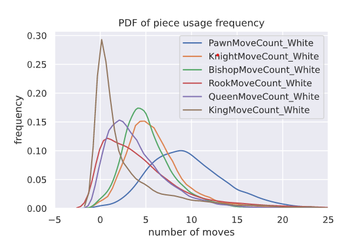
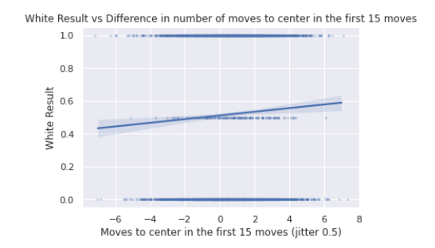
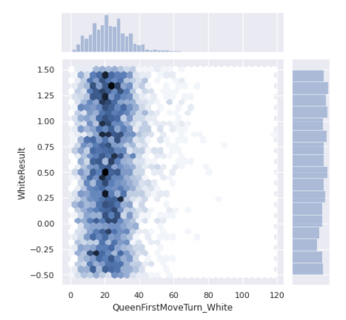

# chess_analysis

***This is a hobby DS project for myself to better understand chess.***

Chess is a strategic game where the goal of the game is to take down the opponent's King.

Because each player gets to move a single piece per turn, it is important to make meaningful moves to avoid wasting turns.

Although there are some guidelines that define what a good vs. bad move is, there are vast amounts of possible game states
in chess which make it difficult to figure out what move is best in the given situation.

So rather than trying to figure out what move is the best for the current game state, I wanted to understand what types of moves generally increase the winning probability.

---

***At a higher level, this project consists of***

1. Data Collection
2. Data Processing
3. Exploratory Data Analysis
4. Feature Extration / Engineering
5. Modelling the conditional expectation with different models. (didn't get to this point yet)

The data was collected from https://www.ficsgames.org/download.html, where you can download the historical game data in pgn format.

I created a custom parser to generate a csv file from the pgn file so that I can easily use them in the python notebook for some visualization and analysis.

***Here are some of the ideas that I wanted to verify with statistics.***

- Does moving certain types of pieces more often than others affect the winning rate?
    - is it better to move Queen early?
    - is it better to move King often?
    - does moving Pawns too often decrease your winning rate?
- Are you more likely to win if your ELO is higher than the opponent?
- Does the castling turn affect the winning probability?
    - is it better to castle early than late?
    - is it better to castle earlier than your opponent?
    - does castling queen side vs. king side affect the winning rate?
- Does dominating the center of the board in the early game increase the chance of winning?
- Does the activity of the elite pieces (K,B,R,Q) affect the winning rate?
- etc

---
***Visualizations***

---

***Result***

By going through this entire process, I learned a few things about chess that I didn't know before.

- too many pawn movements in the early game is not beneficial in the long run because it decreases the defense of your castle. Thus, try to work with 2~3 central pawns in the beginning to support the fight for the center.
- it is better to castle early in the game, but it is better to castle later than your opponent. This is beacuse you can react to opponent's castling (either King or Queen side). By being able to choose the side of your defense, you can make the opponent to waste few moves by forcing the to restructure their attack. Also, activating your Rook early in the game will add a significant strength to your attack.

